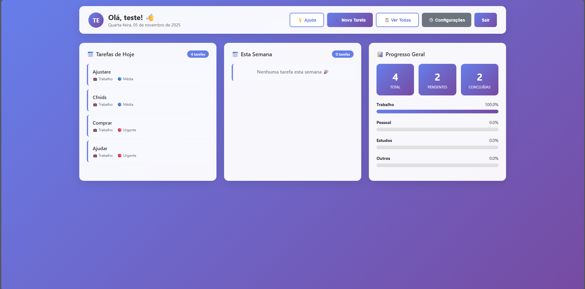
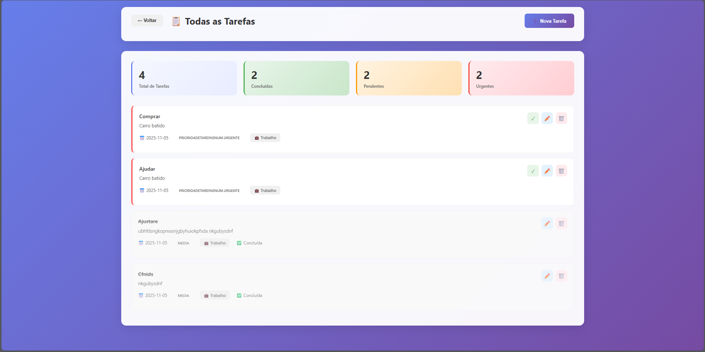
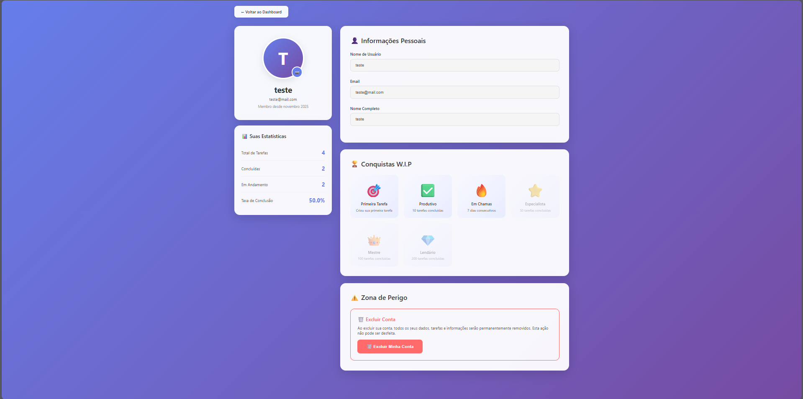

# 📋 Sistema de Gerenciamento de Tarefas

Um sistema web completo e moderno para gerenciamento de tarefas pessoais, desenvolvido com FastAPI e interface intuitiva.


## 🎯 Funcionalidades

- ✅ **Autenticação de Usuários** - Sistema seguro de login e cadastro
- 📊 **Dashboard Interativo** - Visualização completa de tarefas e estatísticas
- ➕ **Gerenciamento de Tarefas** - Criar, editar, concluir e excluir tarefas
- 🎨 **Sistema de Prioridades** - Urgente, Alta, Média e Baixa
- 📁 **Categorização** - Trabalho, Pessoal, Estudos e Saúde
- 🔍 **Busca e Filtros Avançados** - Encontre tarefas rapidamente
- 📈 **Acompanhamento de Progresso** - Estatísticas e gráficos em tempo real
- 👤 **Perfil de Usuário** - Gerenciamento de conta e conquistas
- 🏆 **Sistema de Conquistas** - Gamificação para aumentar produtividade
- 📱 **Design Responsivo** - Funciona perfeitamente em mobile e desktop

## 🚀 Começando

### Pré-requisitos

- Python 3.8 ou superior
- pip (gerenciador de pacotes Python)
- Git

### 📦 Instalação

1. **Clone o repositório**
```bash
git clone https://github.com/BrunnoAlves0011/Gerenciamento-de-Tarefas
cd gerenciador-tarefas
```

2. **Crie um ambiente virtual**
```bash
# Windows
python -m venv venv
venv\Scripts\activate

# Linux/Mac
python3 -m venv venv
source venv/bin/activate
```

3. **Instale as dependências**
```bash
pip install -r requirements.txt
```

4. **Configure as variáveis de ambiente**

Crie um arquivo `.env` na raiz do projeto:
```env
SECRET_KEY=sua_chave_secreta_aqui
DATABASE_URL=sqlite:///./tarefas.db
SESSION_SECRET=sua_chave_de_sessao_aqui
```

5. **Execute o servidor**
```bash
uvicorn main:app --reload
```

6. **Acesse o sistema**

Abra seu navegador e acesse: `http://localhost:8000`

## 📂 Estrutura do Projeto
```
gerenciador-tarefas/
│
├── main.py                 # Arquivo principal da aplicação
├── models.py              # Modelos do banco de dados
├── database.py            # Configuração do banco de dados
├── requirements.txt       # Dependências do projeto
├── .env                   # Variáveis de ambiente (não versionado)
├── .gitignore            # Arquivos ignorados pelo Git
│
├── templates/            # Templates HTML
│   ├── Arquivos de paginas htmls
│
├── static/              # Arquivos estáticos
│   ├── css/
│   │   ├── Arquivos css das paginas
│   └── js/
│       └── Arquivos js das paginas
│
└── README.md           # Este arquivo
```

## 🛠️ Tecnologias Utilizadas

### Backend
- **FastAPI** - Framework web moderno e rápido
- **SQLAlchemy** - ORM para banco de dados
- **Pydantic** - Validação de dados
- **Python-Jose** - Tokens JWT
- **Passlib** - Hash de senhas
- **Starlette** - Gerenciamento de sessões

### Frontend
- **HTML5** - Estrutura das páginas
- **CSS3** - Estilização moderna com gradientes
- **JavaScript** - Interatividade e requisições assíncronas
- **Fetch API** - Comunicação com o backend

### Banco de Dados
- **SQLite** - Banco de dados leve e eficiente
- Suporte para PostgreSQL, MySQL (configurável)

## 📖 Como Usar

### 1. Criar uma Conta
- Acesse a tela de cadastro
- Preencha nome de usuário, email e senha
- Faça login com suas credenciais

### 2. Adicionar Tarefas
- No dashboard, clique em "Nova Tarefa"
- Preencha título e descrição
- Escolha prioridade e categoria
- Defina uma data (opcional)
- Clique em "Criar Tarefa"

### 3. Gerenciar Tarefas
- **Concluir**: Clique no ✓ para marcar como concluída
- **Editar**: Clique no ✏️ para modificar
- **Excluir**: Clique no 🗑️ para remover

### 4. Filtrar e Buscar
- Use a barra de busca para encontrar tarefas
- Filtre por status, prioridade ou categoria
- Combine múltiplos filtros

### 5. Acompanhar Progresso
- Visualize estatísticas no dashboard
- Veja barras de progresso por projeto
- Acompanhe suas conquistas no perfil

## 🎨 Capturas de Tela

### Dashboard


### Lista de Tarefas


### Perfil do Usuário


## 🔐 Segurança

- ✅ Senhas criptografadas com bcrypt
- ✅ Sessões seguras com cookies httponly
- ✅ Proteção contra SQL injection (SQLAlchemy)
- ✅ Validação de dados no backend
- ✅ CORS configurado corretamente

## 🤝 Contribuindo

Contribuições são bem-vindas! Para contribuir:

1. Faça um Fork do projeto
2. Crie uma branch para sua feature (`git checkout -b feature/MinhaFeature`)
3. Commit suas mudanças (`git commit -m 'Adiciona MinhaFeature'`)
4. Push para a branch (`git push origin feature/MinhaFeature`)
5. Abra um Pull Request

## 📝 Roadmap

- [ ] Notificações por email
- [ ] Tarefas recorrentes
- [ ] Compartilhamento de tarefas
- [ ] App mobile (React Native)
- [ ] Integração com calendário
- [ ] Modo escuro
- [ ] Exportar tarefas (PDF/CSV)
- [ ] API pública com documentação

## 🐛 Reportar Bugs

Encontrou um bug? Por favor, abra uma [issue](https://github.com/seu-usuario/gerenciador-tarefas/issues) com:
- Descrição detalhada do problema
- Passos para reproduzir
- Comportamento esperado vs atual
- Screenshots (se aplicável)

## 📄 Licença

Este projeto está sob a licença MIT. Veja o arquivo [LICENSE](LICENSE) para mais detalhes.

## 👥 Autores

- **Brunno Henryque** - *Desenvolvimento* - 

---

⭐ **Se este projeto foi útil para você, considere dar uma estrela!** ⭐

Desenvolvido com 💜 por Brunno Henryque